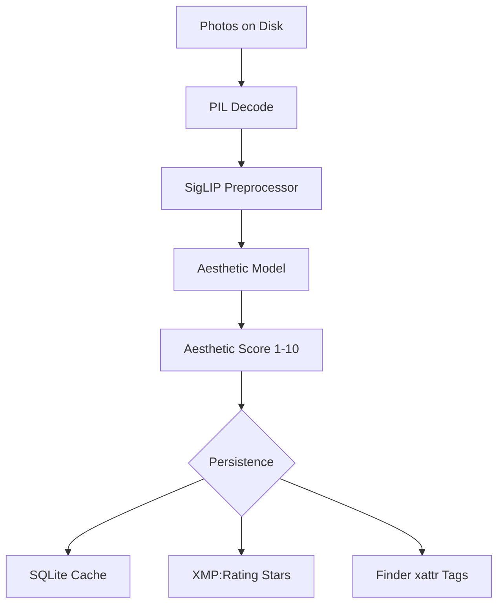

# 🖼️ Image Classifier

[**🌐 View Project Page**](https://wenzelt.github.io/image-classifier/)

> **Stop sifting, start seeing.** Automatically score every photo in your library for aesthetic quality. Writes XMP star ratings directly to metadata so macOS Finder sorts your best shots to the top — instantly.

---

## 📖 The Story

"I was tired of sifting through thousands of images to find the gems. I wanted a software shortcut. I have over 100,000 images, but who ever looks at them again? So I automated it. Now, I use a **SigLIP model by Google** to score aesthetics directly in Finder using tags and EXIF stars."

---

## ✨ Key Features

- **🧠 State-of-the-Art AI**: Uses the `aesthetic-predictor-v2-5` model (SigLIP-based) to score images on a nuanced 1–10 scale.
- **🍎 Apple Silicon Optimized**: Fully supports **MPS (Metal Performance Shaders)** for lightning-fast inference on Mac M1/M2/M3 chips.
- **📂 Finder Integration**: Beyond metadata, it applies native macOS Finder tags (e.g., "7.4") and standard XMP Star Ratings.
- **⚡ Built for Scale**: 
  - **SQLite Caching**: Skips already-scored images for near-instant resumes.
  - **Recursive Scanning**: Process entire folder hierarchies in one go.
  - **Atomic Persistence**: Scores are saved to SQLite *before* metadata writing, ensuring no data loss on crash.
- **🛡️ Robust & Reliable**: Handles truncated JPEGs, unusual colorspaces, and provides a detailed failure log for unreadable files.
- **⏱️ Performance Profiling**: Use the `--profile` flag to see exactly where your time goes (Load vs. Inference vs. Writing).

---

## 🛠️ How it Works



1. **Scan**: Identifies all supported images (`.jpg`, `.png`, `.heic`, `.webp`, etc.).
2. **Score**: Runs the image through the SigLIP model on your GPU/CPU.
3. **Persist**: Saves the raw score and timestamp to a local SQLite database.
4. **Tag**: Updates the file's metadata using `exiftool` and macOS `xattr`.

---

## 📊 Star Rating Scale

We map the 1–10 aesthetic score to a standard 1–5 star system:

| Score | Stars | Label | Finder Experience |
| :--- | :--- | :--- | :--- |
| **8.5 – 10** | ★★★★★ | Exceptional | The absolute best of your library. |
| **7.0 – 8.5** | ★★★★☆ | Great | High-quality shots worth keeping. |
| **5.5 – 7.0** | ★★★☆☆ | Good | Decent photos, standard quality. |
| **4.0 – 5.5** | ★★☆☆☆ | Below Average | Might be blurry or poorly composed. |
| **< 4.0** | ★☆☆☆☆ | Poor | Safe to archive or delete. |

---

## 🚀 Installation

### 1. Requirements
- **macOS** (for Finder tags) or **Linux** (for metadata scoring).
- **Python ≥ 3.11**
- [**uv**](https://github.com/astral-sh/uv) (Fast Python package manager)
- [**exiftool**](https://exiftool.org/) (For metadata writing)

### 2. Setup
```bash
# Install dependencies
brew install uv exiftool

# Clone and sync
git clone https://github.com/wenzelt/image-classifier
cd image-classifier
uv sync
```

---

## 📖 Usage

### Basic Scoring
Score a single folder (skips images already in the database):
```bash
uv run classify ~/Pictures/Vacation
```

### Advanced Options
```bash
# Process subfolders recursively
uv run classify ~/Pictures --recursive

# Re-score everything (overwrites existing ratings)
uv run classify ~/Pictures --force

# Show performance profiling after the run
uv run classify ~/Pictures --profile
```

### View Results in Finder
1. Open your folder in **Finder**.
2. Switch to **List View** (`Cmd + 2`).
3. Right-click the column header and enable **Rating**.
4. Click the **Rating** column to sort descending.

---

## 📂 Project Structure

- `src/image_classifier/`
  - `classifier.py`: Model loading and SigLIP inference logic.
  - `metadata.py`: `exiftool` and `xattr` bridge.
  - `database.py`: SQLite persistence layer.
  - `scanner.py`: Efficient file system crawler.
  - `main.py`: Rich CLI interface and progress tracking.

---

## 🛡️ Data & Privacy

All processing is **100% local**. No images are ever uploaded to the cloud.
- **Database**: `~/.local/share/image-classifier/classify.db`
- **Logs**: `~/.local/share/image-classifier/classify.log`

---

## 🙏 Acknowledgments

- [**aesthetic-predictor-v2-5**](https://github.com/discus0434/aesthetic-predictor-v2-5) for the excellent SigLIP-based model.
- [**Google SigLIP**](https://huggingface.co/docs/transformers/model_doc/siglip) for the underlying vision transformer.
- [**exiftool**](https://exiftool.org/) for being the gold standard of metadata manipulation.
